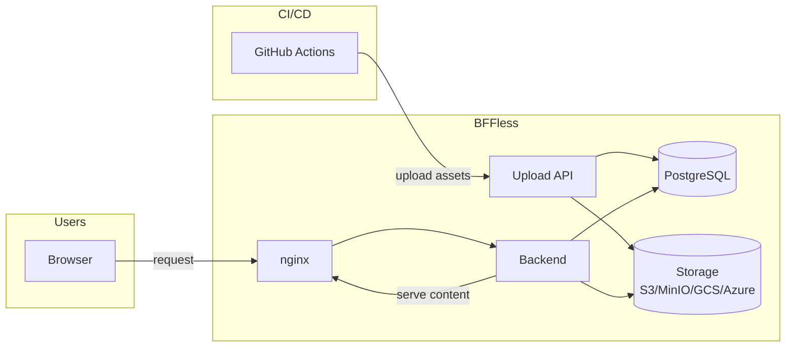

<p align="center">
  
</p>

<h1 align="center">BFFLESS</h1>

<p align="center">
  <strong>The BFF your static frontend deserves.</strong>
</p>

<p align="center">
  <a href="https://docs.bffless.app">Documentation</a> •
  <a href="https://github.com/bffless/ce">Get Started</a> •
  <a href="https://github.com/bffless/ce/issues">Report Issues</a>
</p>

---

BFFLESS is a static asset hosting platform that makes deploying and serving your frontend applications simple, fast, and reliable.



## What is BFFLESS?

BFFLESS provides a streamlined way to host static assets with powerful features:

- **Instant Deployments** — Push your builds and they're live immediately
- **Version Management** — Roll back to any previous deployment with one click
- **Custom Domains** — Connect your own domains with automatic SSL
- **CI/CD Integration** — GitHub Actions for seamless pipeline integration

## Get Started

### Self-Host with Community Edition

Deploy BFFLESS on your own infrastructure with Docker Compose.

**[View the Quickstart Guide](https://docs.bffless.app/getting-started/quickstart/)**

### GitHub Actions

Integrate BFFLESS into your CI/CD pipeline:

```yaml
- uses: bffless/upload-artifact@v1
  with:
    bffless-url: https://admin.your-bffless-instance.com
    api-key: ${{ secrets.BFFLESS_API_KEY }}
    path: dist/
```

## Repositories

| Repository                                                        | Description                                          |
| ----------------------------------------------------------------- | ---------------------------------------------------- |
| [ce](https://github.com/bffless/ce)                               | Community Edition — self-hosted static asset hosting |
| [upload-artifact](https://github.com/bffless/upload-artifact)     | GitHub Action to upload build artifacts              |
| [download-artifact](https://github.com/bffless/download-artifact) | GitHub Action to download artifacts                  |
| [docs-public](https://github.com/bffless/docs-public)             | Documentation site source                            |
